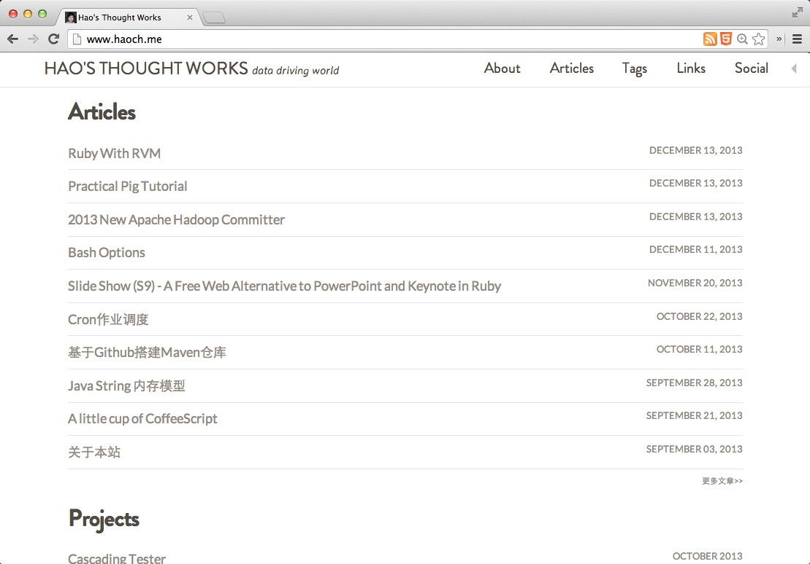
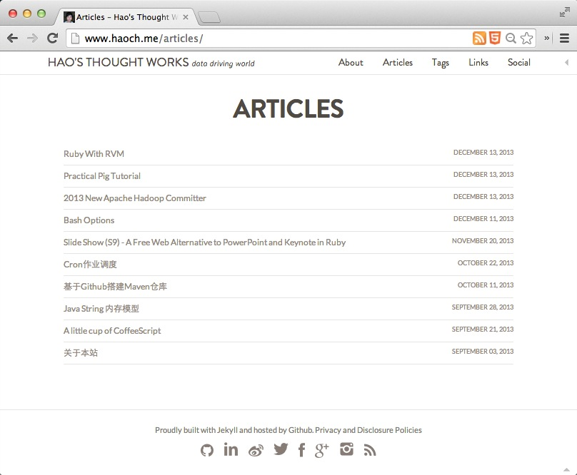
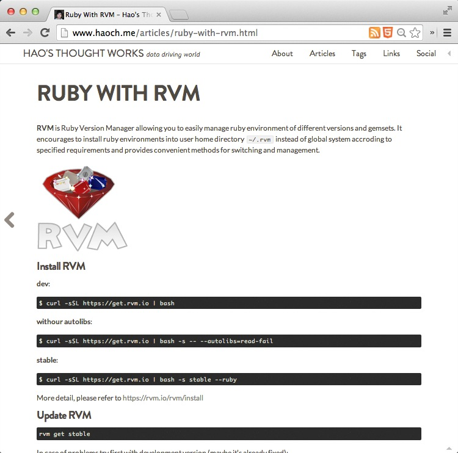
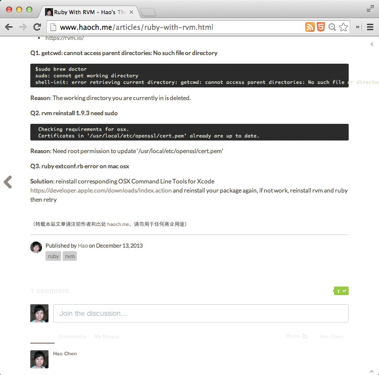
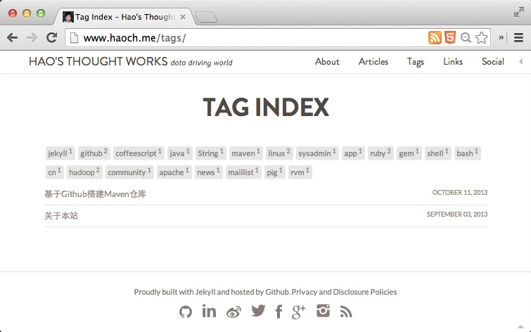

jekyll-lstg
===========

Another simple and clear jekyll theme. 

The project [`jekyll-lstg`](https://github.com/haoch/jekyll-lstg) is originally developed for my own site at: <http://haoch.me>, then splited out as a independent theme template for being shared with more people like such simple and clear stye.

Screenshot
----------

### Home

### Page

### Post

#### Tag

