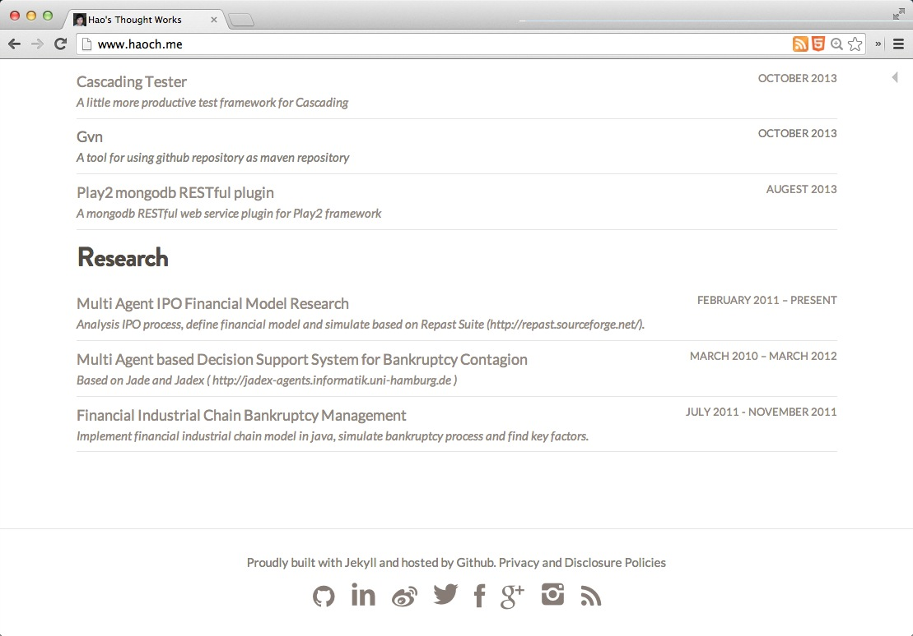

Jekyll-Listing
==============

A Simple and Clear Jekyll Theme: LSTG - Listing, just list what deserves being written down where they are.

The project [`jekyll-lstg`](https://github.com/haoch/jekyll-lstg) is originally developed for my own site at: <http://haoch.me>, then splited out as a independent theme template for being shared with more people like such simple and clear stye.

Screenshot
----------

### Home

### Page

### Post

#### Tag

